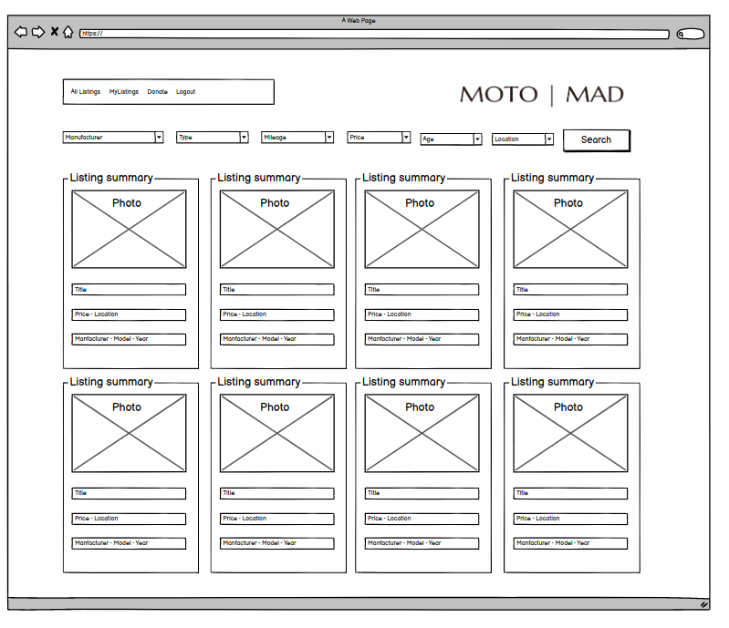

# README

The brief for the project was to complete a two way market place, in which any given user could act as both a buyer or a seller. Second hand motorcycles were chosen partly because of personal interest, but also because the characteristics of bikes lend themselves to being easily classified by the categories seen in the drop down menus that could be used to filter or sort listings (a feature to be completed after the bootcamp).

This project was not completed to the desired level during the bootcamp project due to time constraints that resulted from trying and abandoning another project idea (We Talky, also on GitHub).

MotoMad is hosted on Heroku at <a href="https://moto-mad.herokuapp.com/">https://moto-mad.herokuapp.com</a>.

<!----------------------------------------------------- -->

<h3>Technology used</h3>

The website is built on Ruby version 2.7.0, and uses version 5.2.4.3 of the Rails framework.

The following third party services are used in the application:

<ul>
    <li>MotoMad uses the open source <b>PostgreSQL</b> database management system.</li>
    <li>The <b>Devise gem</b> has been used to create user profiles and encrypted passwords, as well as to and manage site access via the "current_user" feature. Site access restrictions are what makes it possible to grant the owner of a listing the exclusive ability to make listing changes or respond to listing questions.</li>
    <li>The site uses the <b>Heroku</b> PaaS (platform as a service). Heroku provides the servers to host the site, networking services to manage the servers, and security support. </li>
    <li>Any images uploaded by users to listings are saved on <b>Amazon S3</b>. S3 is a cloud storage service which allows the most memory intensive user data to be saved away from the code base of the application.</li>
    <li>There is donation feature which is handled directly by the provider <b>Stripe</b>. Stripe uses its API keys in order to allow a user to make a secure credit card payment online before re-directing a user back to MotoMad.</li>
    <li><b>Bootstrap</b> has been used to style the site and make it responsive</li>
</ul>

<!----------------------------------------------------- -->

<h3>Site map</h3>

The above site map differs from the deployed application in only one respect, which is the existence of the favourites page that has not (yet) been developed.

<!----------------------------------------------------- -->

<h3>ERD</h3>

This is the Entity Relationship Diagram for the database created on Postgres. Again, the favourites feature is under development.

<!----------------------------------------------------- -->

<h3>Site functionality</h3>

From the site home page, a user must create a profile in order to login, create or view listings. There is an "About this project" page on the website with screenshots to illustrate the user experience described below. 

Users can:

<li>View the all listings summary page from other users;</li>
<li>View individual listings, the sellers email address, and post questions for the seller to respond to;</li>
<li>Create a listing;</li>
<li>Only the seller can view the email address of anyone who has posted a question to their listing;</li>
<li>Sellers can respond to questions</li>

In addition, the site was planned with the following additional functionality in mind:

<li>To be to create a page of favourite listings;</li>
<li>To be able to filter and sort listings, as illustrated in the wireframe below:</li>

